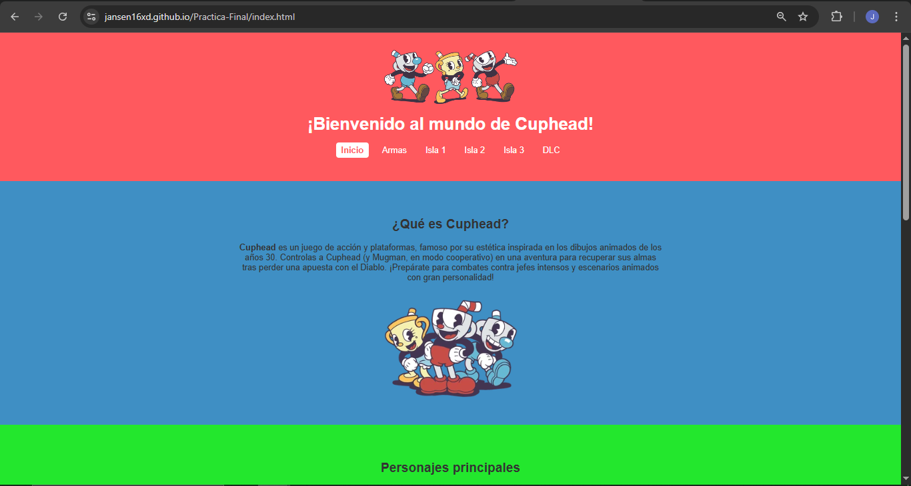
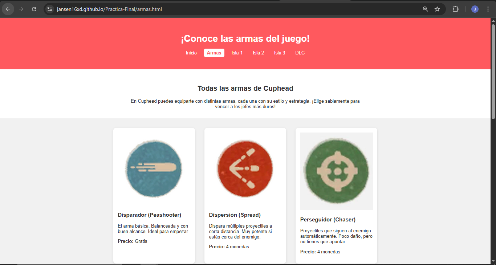

# Practica-Final

# Proyecto Web: Cuphead

## Tema elegido
He hecho una pagina web sobre el videojuego **Cuphead**, un juego muy famoso por su estilo de dibujos animados antiguos y por los combates contra jefes muy dificiles.

## Estructura y layout
La web esta dividida en diferentes archivos HTML:

- **index.html**: la pagina principal.
- **armas.html**: informacion sobre las armas del juego.
- **isla1.html**: jefes de la primera isla.
- **isla2.html**: jefes de la segunda isla.
- **isla3.html**: jefes de la tercera isla.
- **dlc.html**: jefes del DLC (no he incluido los del tablero de ajedrez).

Todas las paginas tienen un **menu de navegacion** arriba y un **footer** con mi nombre. Tambien he usado <section> para agrupar contenido y <article> para cada jefe.

## Estilo CSS y efectos visuales
- He usado un archivo styles.css para el diseño general.
- Cada isla tiene un color de fondo distinto.
- Las tarjetas de los jefes tienen imagen, titulo y descripcion.
- Todo esta hecho para que sea visual y facil de leer.
- Use flexbox para que las tarjetas se acomoden bien en diferentes pantallas.

## Eleccion de diseño
- Elegi Cuphead porque me gusta mucho el juego y su estilo de dibujos.
- Queria que cada isla se diferenciara con colores distintos.
- No use efectos muy complicados para que la web fuera clara y facil de entender.
- Tambien pense en que se vea bien desde el movil.

## Capturas de pantalla

### Pagina de Inicio

### Pagina de Armas

### Pagina de Isla 1

### Pagina de Isla 2

### Pagina de Isla 3

### Pagina del DLC

